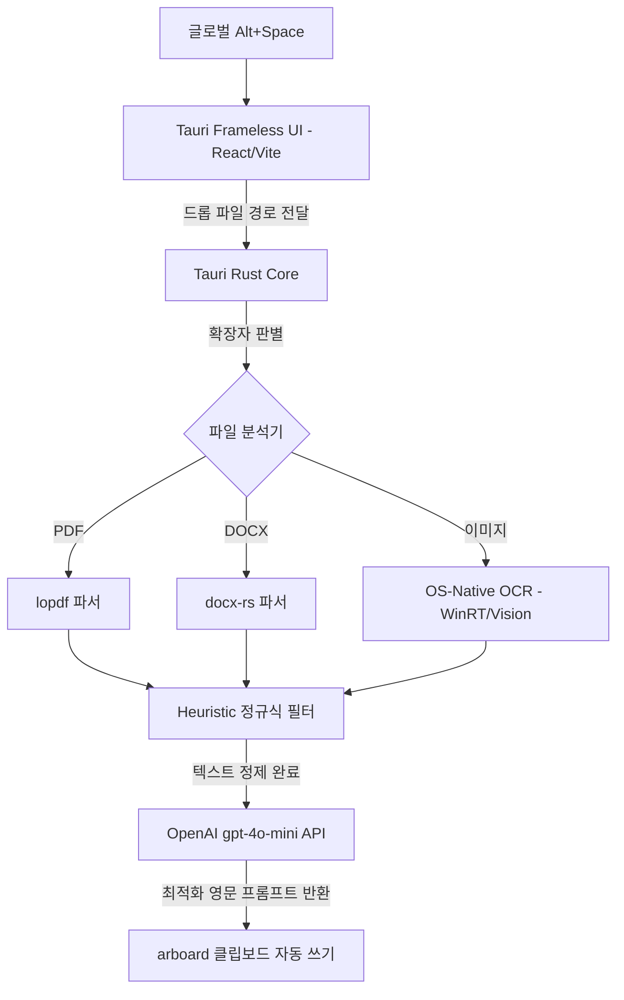

# T.O. (Token Optimizer) 기술 조사 및 전략 보고서 (Research Report)

본 보고서는 LLM API 사용 시 토큰 비용을 최소화하고, 다중 파일(PDF, Word)과 이미지(OCR)를 자동으로 영문 최적화 프롬프트로 변환하여 클립보드에 상주하는 초경량 램 상주 유틸리티를 구축하기 위한 기술 조사 및 개발 전략을 다룹니다.

---

## 1. 프롬프트 최적화 솔루션 벤치마킹 및 비교

현재 시장의 대표적인 프롬프트 최적화 기술 및 상업용 서비스의 특징과 장단점은 다음과 같습니다.

| 서비스 / 기술 | 주요 작동 원리 및 특징 | 장점 | 단점 | 우리 프로젝트의 활용 방향 |
| :--- | :--- | :--- | :--- | :--- |
| **MS LLMLingua** | 소형 언어 모델(SLM)을 사용해 정보 엔트로피를 기반으로 비필수 토큰을 계산하고 삭제하는 오픈소스 프레임워크. | * 탁월한 비용 절감 (최대 20배 압축) * 정보 손실 최소화 및 구조 유지 | * 로컬 SLM(예: LLaMA-2-7b) 구동에 필요한 고사양 로컬 리소스 요구 (RAM/GPU). | * 모바일/데스크톱용 경량화 기법 참고. * 로컬 정규식 Heuristic 필터링과 결합하여 구현. |
| **PromptPerfect** | 입력된 프롬프트를 다중 모델 및 프롬프트 최적화 기법을 사용해 강화하는 상업용 Web 서비스. | * 영어/한글 등 다국어 변환 최적화 지원. * 대시보드 및 API 연동 제공. | * 외부 API 기반으로 지연시간(Latency) 발생. * 사용량 기반 구독 요금제 적용 (비용 발생). | * 최종 LLM 지시어 템플릿(System Prompt) 작성 패턴 벤치마킹. * 극단적인 단답형 영문 변환 페르소나 적용. |
| **Bear API / LLM-ready Parsers** | 마크다운 포맷팅 및 파일 메타데이터 제거를 처리하는 API 기반 파서 서비스. | * API 호출 한 번으로 깔끔한 마크다운 추출 가능. | * 오프라인 상태에서 사용 불가. * 민감한 문서 전송 시 보안 우려 존재. | * OS-Native (WinRT / Vision) 기반 로컬 OCR 및 Pure Rust 라이브러리로 대체 구현. |

---

## 2. 기술 스택 선정 전략 (하이브리드 아키텍처)

데스크톱 앱 패키징 용량 최소화(15MB 이하) 및 시스템 리소스 극소화, macOS 공증 문제를 해결하기 위해 다음과 같은 하이브리드 기술 스택을 선정했습니다.

* **Frontend:** Vite + React + Tailwind CSS v4 (Glassmorphism 프레임리스 윈도우 UI)
* **Backend Core:** Tauri v2 (Rust) (OS 글로벌 단축키 토글, 포커스 blur 이벤트 감지 자동 숨김 처리)
* **Native OCR:** Windows WinRT OCR (`Windows.Media.Ocr`) & macOS Vision OCR (로컬 API 무상 사용 및 오프라인 구동)
* **File Parser:** `lopdf` (Rust PDF 파싱) & `docx-rs` (Rust DOCX 파싱)
* **LLM Client:** `reqwest` 비동기 클라이언트를 통한 OpenAI `gpt-4o-mini` API 통신

---

## 3. 세부 구현 가이드 및 성능 최적화

1. **메모리 상주 최소화:** Rust 코어로만 컴파일하여 RAM 점유율을 30MB 이하로 유지.
2. **비동기 IO 파이프라인:** 문서 추출 및 LLM API 요청 시 UI 스레드를 차단하지 않도록 비동기 처리 적용.
3. **토큰 절감 Heuristics:**
   * 연속된 3회 이상의 줄바꿈(`\n\n\n+`)을 2개로 압축.
   * 다중 탭 및 연속된 공백을 단일 공백으로 치환.
   * 의미 없는 인사말 및 시스템 코드 보일러플레이트 제거.
